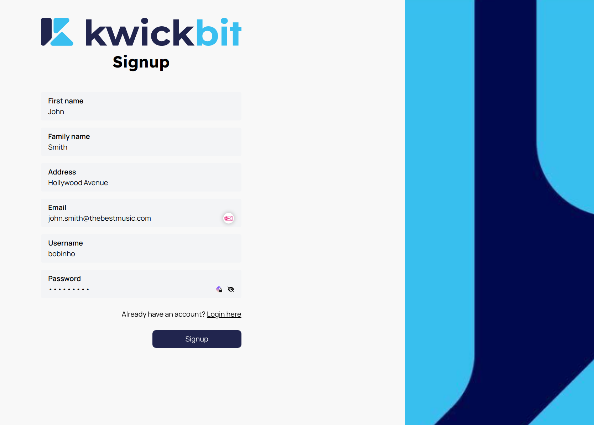
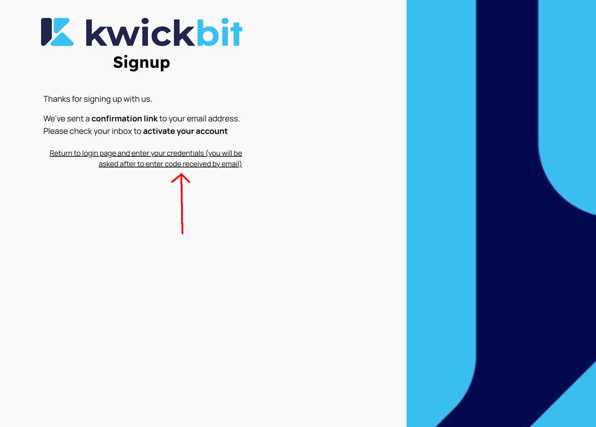
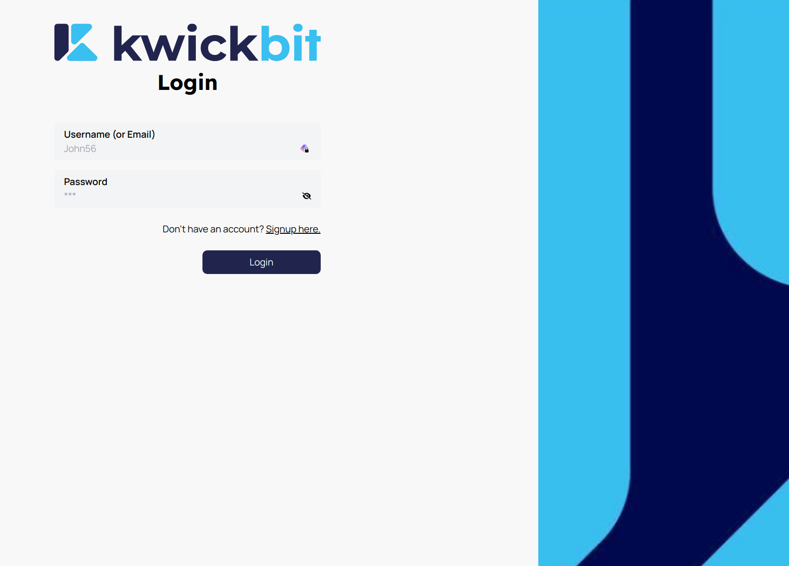
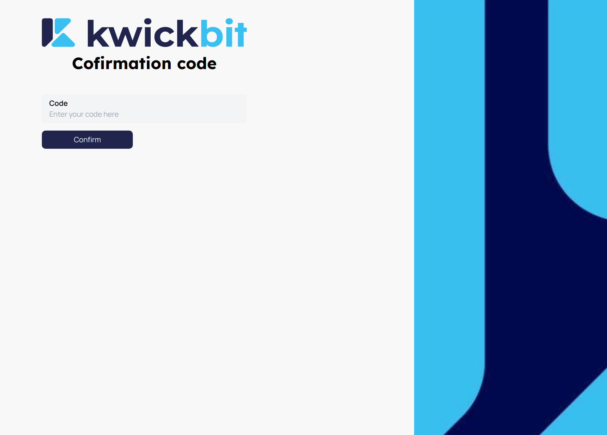

# Getting Started with KwickBit

Welcome to KwickBit! Follow these steps to create your account and start integrating your cryptocurrency transactions with QuickBooks:

**Important Note**: If authentication fails when using your email in the credentials, try logging in with your username instead.

1. **Go to signup page from login page**: Visit the KwickBit webpage and find the "Don't have an account?" section. Click on the "Signup" link.

2. **Provide Your Information**: Fill in the signup form with your name, surname, a unique username
   (the signup process will fail if the chosen username is already taken), and a valid email address
   (necessary for account activation).

3. **Signup Confirmation**: After clicking "Signup," you'll be redirected to a confirmation page with a link to the login page.

4. **Email Activation**: Check your email for an activation code sent by KwickBit.

5. **Activate Your Account**: Go to the login page, enter your credentials

6. **Confirm Activation Code**: You should be directed to a page where
   you should input the activation code received by email. After entering the code, click "Confirm Code."
   You will be directed back to the login page.

7. **Log In**: Enter your credentials once again and click "Login." You should now be successfully logged into KwickBit and ready to start using the service.

By following these steps, you can swiftly set up your KwickBit account and begin the journey of seamless crypto-accounting integration.
