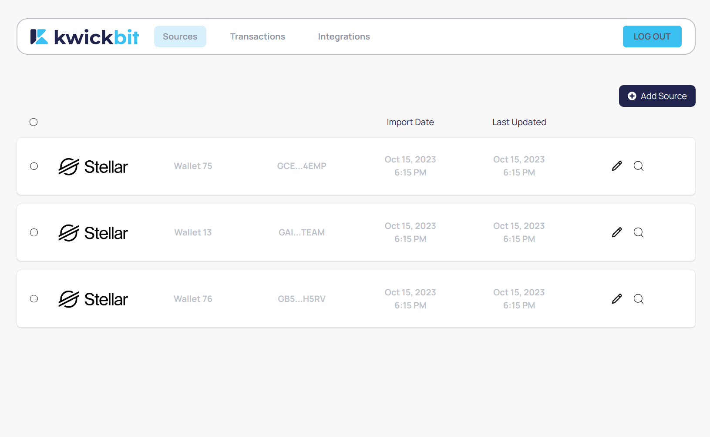
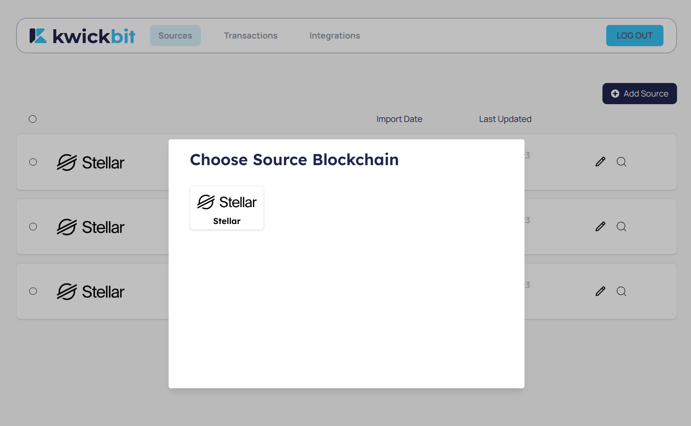
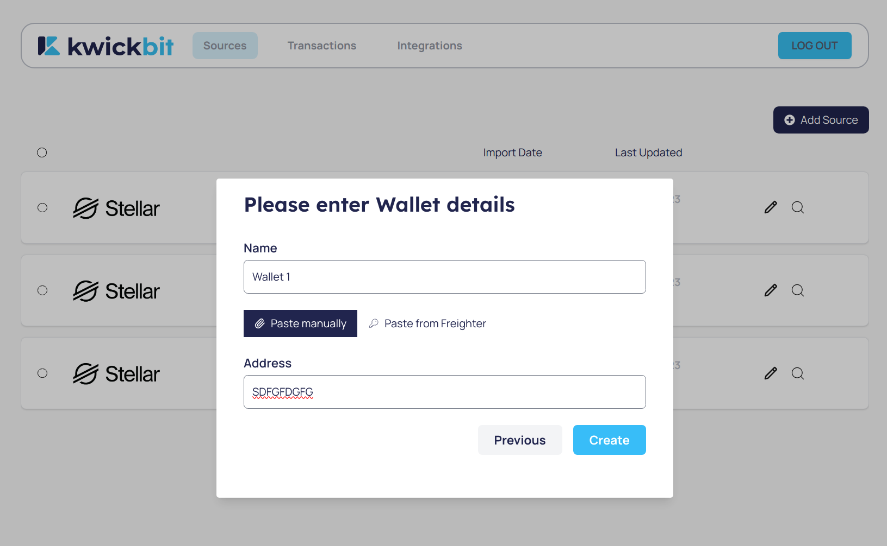
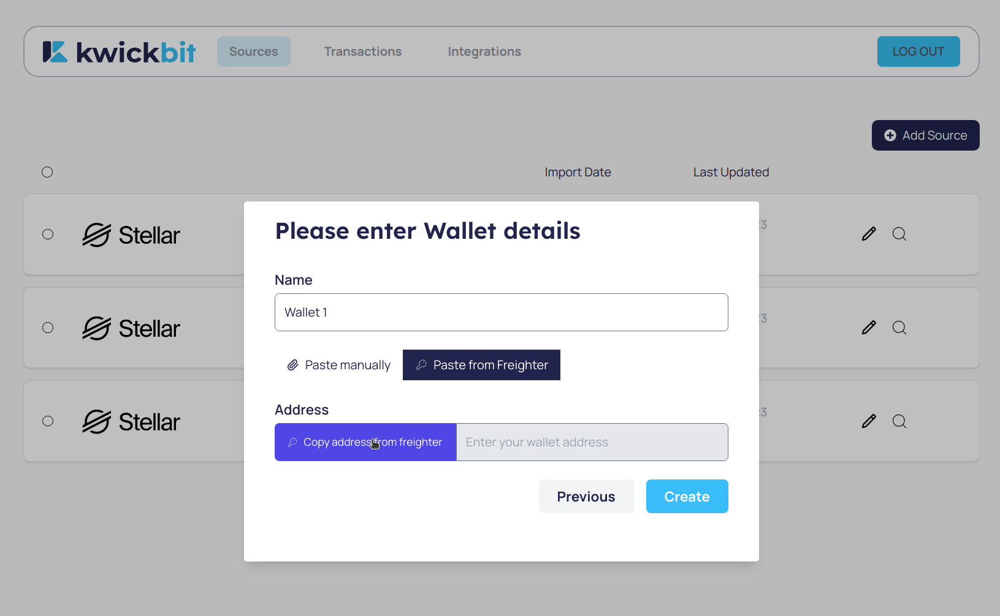

# Sources

The Sources section in KwickBit allows users to manage their cryptocurrency wallets. This is the first step to bridge your crypto assets with accounting software like QuickBooks.

## Adding a Source Wallet

To start tracking your transactions in KwickBit, you first need to add your cryptocurrency wallet as a source. Here's how:

1. **Navigate to the Sources Page**: Access KwickBit and go to the 'Sources' page from the dashboard.

2. **Add a New Source**: If you don't have any source wallets added, you'll see a prompt to add one. Click on 'Add Source'.

3. **Select Blockchain**: Choose the blockchain of your wallet from the list of supported blockchains.

4. **Name and Address**: Give your wallet a memorable name and paste its public address. Alternatively, use Freighter to securely add your wallet.

    (Optional) You can also paste your address from Freighter wallet

5. **Fetch Transactions**: Upon adding your wallet, KwickBit will automatically fetch its transactions from the blockchain. These transactions will be available in the 'Transactions' section.

Remember, KwickBit only requires your public address to fetch transactions, ensuring your assets remain secure.

## Managing Your Wallets

- **View Wallet List**: All added wallets are listed in the 'Sources' page, allowing you to easily view and manage them.

Adding your wallets to KwickBit is the first step towards simplifying crypto accounting. Next, learn how to integrate these details with QuickBooks in the Integrations section.
