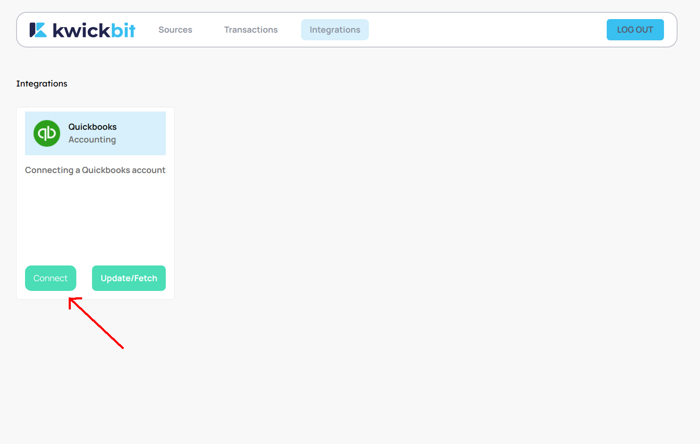
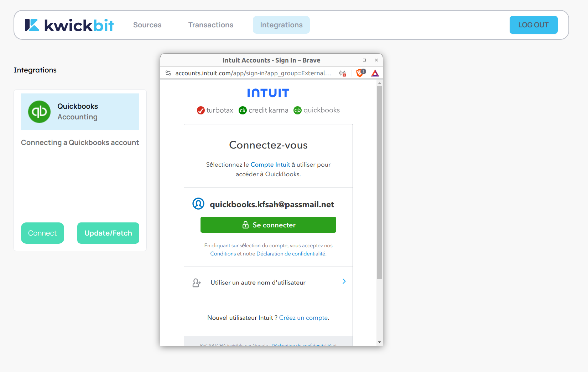
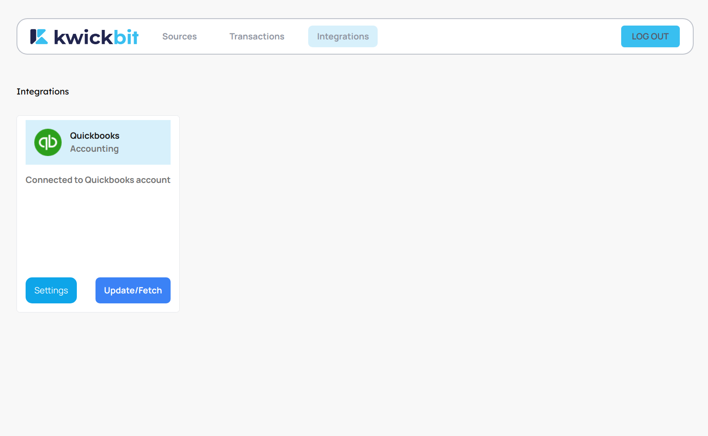
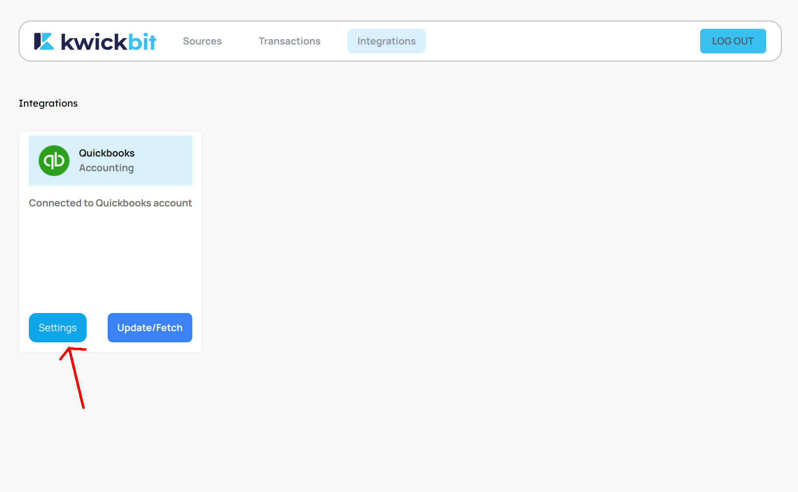
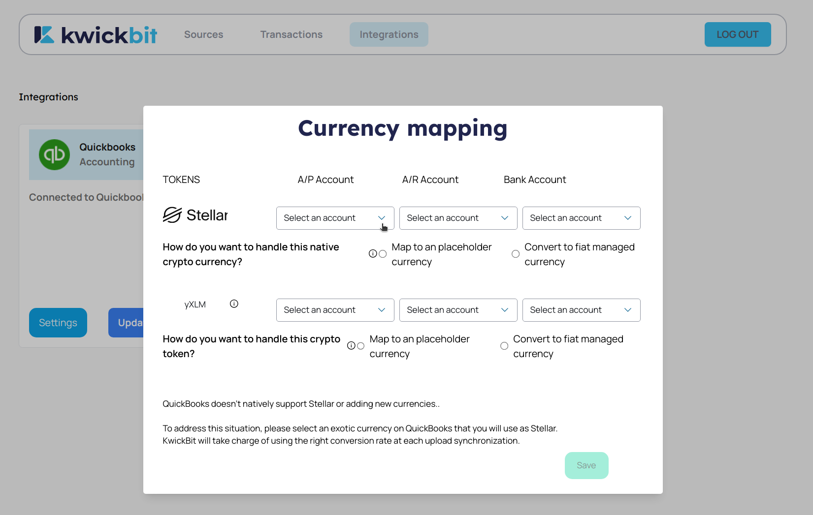
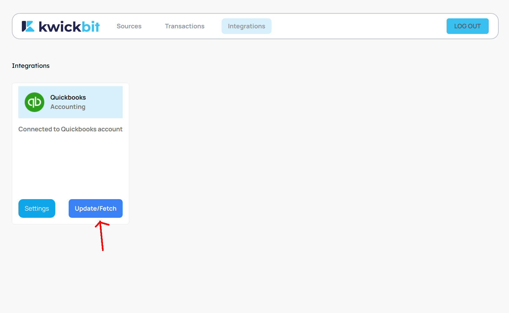
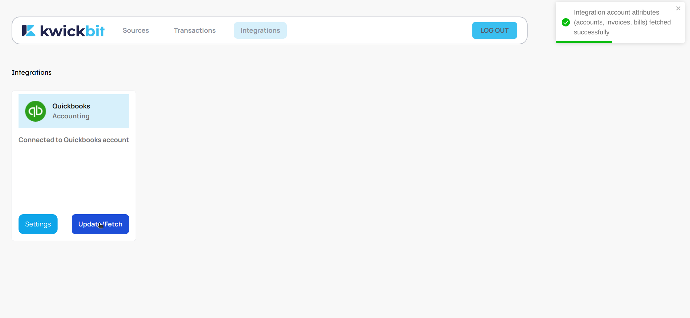

# Integrations Section

## QuickBooks Integration

Integrating KwickBit with QuickBooks streamlines your crypto and traditional accounting processes.
This guide walks you through connecting KwickBit to QuickBooks, configuring your account settings, and managing your financial data with ease.

### Initial Setup

1. **Connect to QuickBooks**: On your first visit to the 'Integrations' section, you'll see the QuickBooks card.
Click the 'Connect' button to begin the integration process.

2. **Authenticate with QuickBooks**: A modal window will appear, prompting you to authenticate via OAuth with
your QuickBooks account. Follow the instructions to log in and authorize KwickBit's access.

3. **Configuration Settings**: After successful authentication, the 'Connect' button will be replaced with a 'Settings' button. Clicking this button opens a modal where you can configure your financial mappings.

### Configuring Financial Mappings

1. **Access Configuration Settings**: After successful authentication, the 'Connect' button will be replaced with
a 'Settings' button. **Click the 'Settings' button to make the financial mappings modal appear**. This is where you
can configure your financial mappings.

2. **Configuring Mappings** In the settings modal, you must assign specific QuickBooks accounts for each token:
- **Accounts Receivable Account**
- **Accounts Payable Account**
- **Bank Account**
    Ensure that the selected accounts are denominated in the same currency for consistent financial reporting.

**For more information about this part, go to the [Token Mappings](./03-token-mappings.md) section.**

3. **Saving Your Configuration**: Once you've set all mappings, click the 'Save' button to finalize your
configurations.

4. **Fetching Data from QuickBooks**: To ensure that KwickBit has the latest financial data from QuickBooks,
click the 'Update/Fetch' button. This step is crucial for publishing transactions to QuickBooks accurately.

5. **Notification from Fetching Quickbooks data**: A small notification appears on the screen once the fetching is complete.

