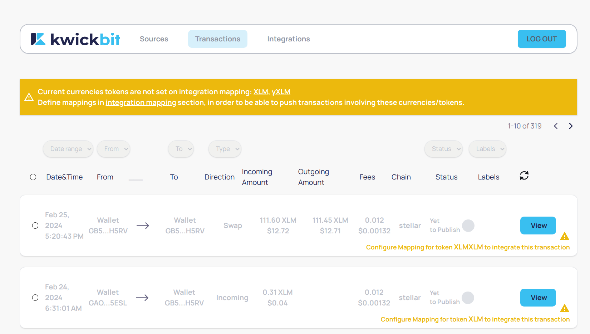
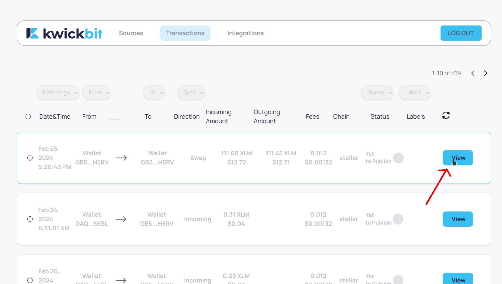
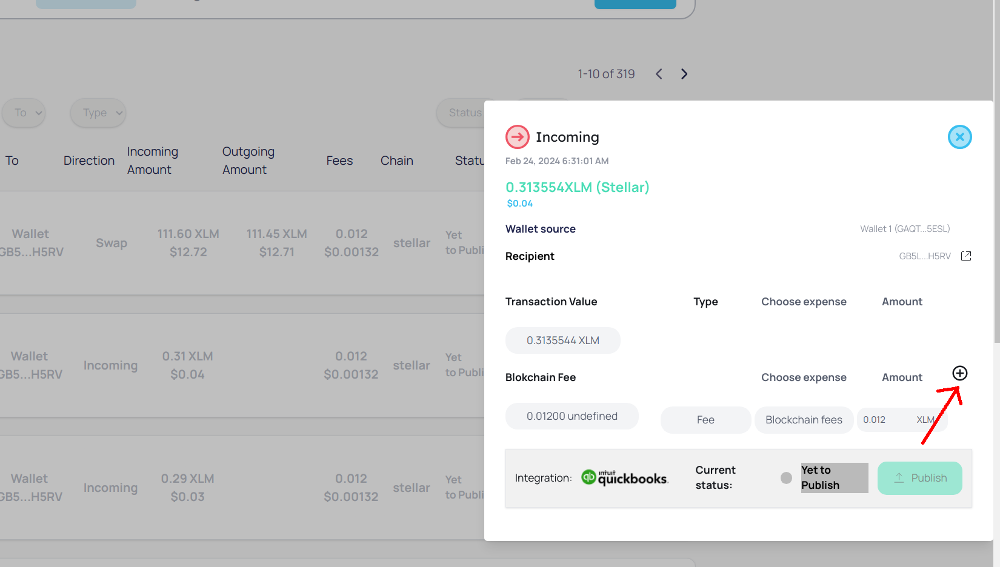
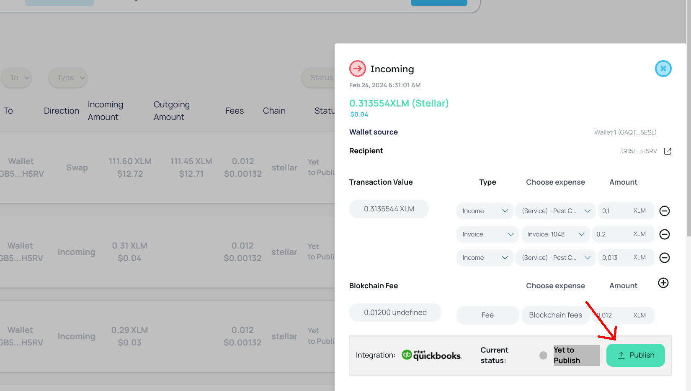
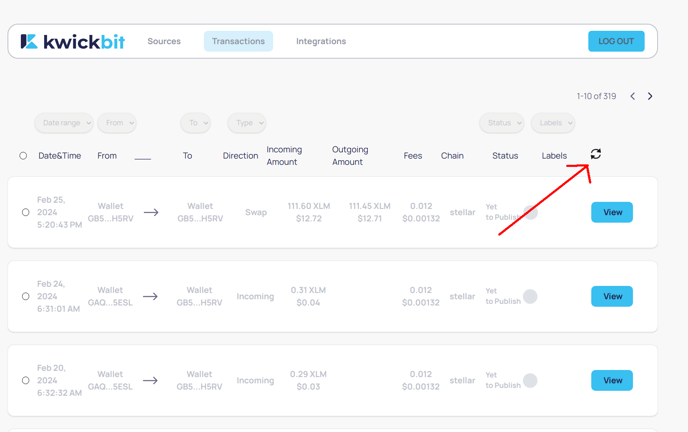

# Transactions Section

## Overview

The Transactions section in KwickBit displays all the crypto transactions associated with your connected wallets. Transactions are categorized by their direction: Incoming, Outgoing, or Swap. This setup allows users to manage their transactions, categorize them accordingly, and publish them directly to QuickBooks for seamless accounting integration.

### Important Notice on Token Configuration

Before attempting to publish transactions to QuickBooks, ensure that each involved crypto token is properly
configured in the Integrations section. **If a crypto token is not configured, KwickBit will display an orange
banner to warn you that transactions involving this unconfigured token cannot be published to QuickBooks.**
Proper configuration is essential for accurate financial reporting and reconciliation.

### Transaction Directions

- **Incoming**: You are receiving funds.
- **Outgoing**: You are sending funds.
- **Swap**: You are trading one currency for another.

### Viewing and Splitting Transaction Details

1. To access more information about a transaction, click the "View" button next to the transaction in the list. This will open a modal with detailed information.

2. In this modal, you can split the transaction amount into different sub-amounts for more detailed accounting in QuickBooks.

3. After categorizing and confirming the transaction details, click the "Publish" button.

4. There is no need to refresh the page; the transaction list will update automatically once the transaction is successfully published to QuickBooks.

### Fetching Latest Transactions
To ensure you are viewing the most up-to-date transaction data, click the "Fetch" button, symbolized by a two-arrows circle icon. This will update your transaction list with the latest activities from your wallets and QuickBooks.

### Categorizing Transactions

#### Incoming Transactions
- Choose **Income** if the transaction represents direct income, and then select an appropriate income account.
- Select **Invoice** if the transaction settles an invoice, then choose the specific invoice from the dropdown menu.

#### Outgoing Transactions
- Choose **Expense** if the transaction is an expense, and then select a category item for that expense.
- Select **Bill** if the transaction pays off a bill, then choose the specific bill from the dropdown menu.

#### Swap Transactions
- For swap transactions, select a bank account for the incoming amount and another for the outgoing amount.

## Final Note

Ensure all crypto tokens involved in your transactions are set up correctly within the Integrations section of KwickBit. By doing so, you avoid disruptions when publishing to QuickBooks and ensure the integrity of your financial records. KwickBit's user-friendly notifications, such as the orange banner for unconfigured tokens, streamline your crypto accounting process, merging seamlessly with traditional financial systems.
